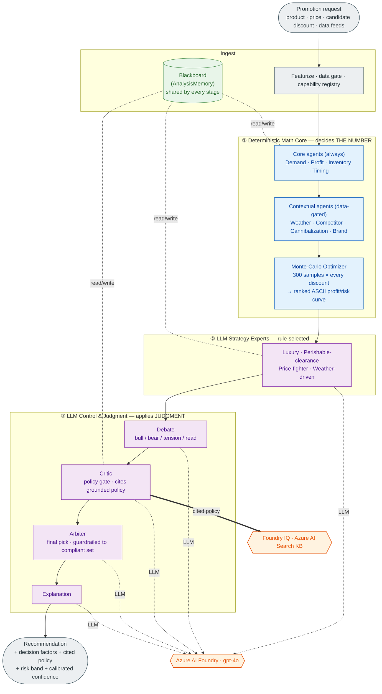

# MarginIQ — Architecture

## Microsoft stack

| Layer | Technology | Role in MarginIQ |
|---|---|---|
| Reasoning | **Azure AI Foundry** (gpt-4o deployment) | Powers every LLM stage — strategy experts, debate, critic, arbiter, explanation. The reasoning client routes through the Azure AI Foundry endpoint. |
| Grounding | **Foundry IQ** | Agentic knowledge retrieval. The critic queries Foundry IQ for the pricing-policy passages relevant to each decision and cites the source document in its verdict, reducing hallucination and making the policy check auditable. |
| Knowledge base | 3 synthetic policy documents | `pricing_policy.md`, `brand_guidelines.md`, `clearance_policy.md` — the grounded source of truth Foundry IQ retrieves from. |

> MarginIQ runs exclusively on Azure. The reasoning client (`azure_reasoning.py`) calls
> Azure AI Foundry for every LLM stage, and the Foundry IQ client (`foundry_iq.py`)
> retrieves grounded policy from the hosted knowledge base (Azure AI Search). Both are
> required — there is no alternate provider and no local fallback.

## Architecture at a glance



**Three responsibilities, kept separate by design:** ① the **math** decides the number
(elasticity, simulation, risk), ② the **strategy experts** add category judgment, and
③ the **control layer** debates, verifies against grounded policy, makes the final call,
and explains it. The math core and the critic/arbiter always run; the planner only
chooses which expensive experts are worth running.

## How the system works (end to end)

```
┌─────────────────────────────────────────────────────────────────────────────────┐
│                              HTTP REQUEST                                       │
│          product · discount · price · inventory · all data feeds                │
└───────────────────────────────────┬─────────────────────────────────────────────┘
                                    │
                                    ▼
┌─────────────────────────────────────────────────────────────────────────────────┐
│  INGEST & FEATURIZE                                                             │
│  • Build AnalysisMemory (blackboard) — shared across every step                │
│  • Scan all data feeds → data_inventory (which feeds are present / missing)    │
│  • Data gate: a capability is eligible only if every feed it needs is present   │
└───────────────────────────────────┬─────────────────────────────────────────────┘
                                    │
                                    ▼
┌─────────────────────────────────────────────────────────────────────────────────┐
│  MATH AGENTS                                                                    │
│                                                                                 │
│  Core — always run                                                              │
│  ┌──────────────┐  ┌──────────────┐  ┌──────────────┐  ┌─────────────────┐   │
│  │  Demand      │  │  Profit      │  │  Inventory   │  │  Timing         │   │
│  │  Model       │  │  Model       │  │  Model       │  │  Model          │   │
│  └──────────────┘  └──────────────┘  └──────────────┘  └─────────────────┘   │
│                                                                                 │
│  Contextual — run automatically when their data feed is present                │
│  ┌──────────────┐  ┌──────────────┐  ┌──────────────────┐  ┌──────────────┐  │
│  │  Weather     │  │  Competitor  │  │  Cannibalization │  │  Brand       │  │
│  │  Model       │  │  Model       │  │  Model           │  │  Model       │  │
│  └──────────────┘  └──────────────┘  └──────────────────┘  └──────────────┘  │
│                                                                                 │
│  All agents write their findings to the blackboard.                            │
│                                                                                 │
│  Optimizer (Monte-Carlo) runs after all math agents complete:                  │
│  300 samples × every candidate discount → ranked scenarios + ASCII curve       │
└───────────────────────────────────┬─────────────────────────────────────────────┘
                                    │
                                    ▼
┌─────────────────────────────────────────────────────────────────────────────────┐
│  LLM STRATEGY EXPERTS                                                           │
│                                                                                 │
│  Which experts run is decided by fixed rules (no LLM involved):                │
│    luxury category + brand signals        →  luxury_strategist                 │
│    inventory findings present             →  perishable_clearance_strategist   │
│    competitor data present                →  commodity_price_fighter           │
│    weather + calendar, beverages/frozen   →  weather_driven_strategist         │
│                                                                                 │
│  ┌───────────────────────┐  ┌────────────────────────────┐                    │
│  │  luxury_strategist    │  │  perishable_clearance_     │                    │
│  │                       │  │  strategist                │                    │
│  │  Protect price image. │  │  Clear short-shelf stock   │                    │
│  │  Resist repeated deep │  │  before spoilage. Weigh    │                    │
│  │  discounts on premium │  │  spoilage cost vs margin   │                    │
│  │  brand.               │  │  loss.                     │                    │
│  └───────────────────────┘  └────────────────────────────┘                    │
│                                                                                 │
│  ┌───────────────────────┐  ┌────────────────────────────┐                    │
│  │  commodity_price_     │  │  weather_driven_strategist │                    │
│  │  fighter              │  │                            │                    │
│  │  Defend market share  │  │  Read the forecast and     │                    │
│  │  when competitor      │  │  season. Act on short      │                    │
│  │  intensity is high.   │  │  demand windows.           │                    │
│  └───────────────────────┘  └────────────────────────────┘                    │
│                                                                                 │
│  Each expert reads the full blackboard and writes a stance + open questions.   │
└───────────────────────────────────┬─────────────────────────────────────────────┘
                                    │
                                    ▼
┌─────────────────────────────────────────────────────────────────────────────────┐
│  DEBATE  (LLM)                                                                  │
│                                                                                 │
│  Receives: ASCII profit/risk curve + blackboard findings                        │
│                                                                                 │
│  discount | profit (#=$)              | downside | risk                         │
│      0%   |                           |     2%   | low                          │
│      5%   |########                   |     4%   | low  <= best                 │
│     10%   |################           |     9%   | low                          │
│     15%   |####################       |    18%   | medium                       │
│     ...                                                                         │
│                                                                                 │
│  Returns 4 structured bullets:                                                  │
│    BULL:     why a deeper / bolder discount is justified                        │
│    BEAR:     why caution / shallower is safer                                  │
│    TENSION:  the core trade-off that makes this hard                           │
│    READ:     the moderator's overall read of the situation                     │
└───────────────────────────────────┬─────────────────────────────────────────────┘
                                    │
                                    ▼
┌─────────────────────────────────────────────────────────────────────────────────┐
│  CRITIC  (LLM, mandatory)  ◀── grounded by Foundry IQ                           │
│                                                                                 │
│       ┌───────────────────────────────────────────────────────────────┐        │
│       │  FOUNDRY IQ  (grounded policy retrieval)                       │        │
│       │  Query built from category + discount + inventory/brand state │        │
│       │  Retrieves cited passages from the policy knowledge base:     │        │
│       │    • pricing_policy.md   (margin floor, loss, service gates)  │        │
│       │    • brand_guidelines.md (depth limits, reference price)      │        │
│       │    • clearance_policy.md (spoilage override rules)            │        │
│       └───────────────────────────────────────────────────────────────┘        │
│                                                                                 │
│  Receives: ASCII curve + findings + best scenario + CITED policy passages       │
│  Checks each gate against the retrieved policy and CITES the document applied   │
│                                                                                 │
│  accepted = true   →  pass through                                              │
│  accepted = false  →  constrain to policy-compliant scenarios and re-present   │
│                        the best compliant one  (status = "accepted_after_retry")│
└───────────────────────────────────┬─────────────────────────────────────────────┘
                                    │
                                    ▼
┌─────────────────────────────────────────────────────────────────────────────────┐
│  ARBITER  (LLM, mandatory)                                                      │
│                                                                                 │
│  Receives: ASCII curve + findings + optimizer summary + verification result     │
│  Guardrail: can only pick from the compliant scenario set.                     │
│                                                                                 │
│  Produces:                                                                      │
│    • recommended_discount  (final answer)                                       │
│    • decided_by  (optimizer / arbiter)                                          │
│    • decision_factors  (economics-based justifications, not log lines)          │
│                                                                                 │
│  Shallow-override check: if best is 0% but competitive + weather heat present, │
│  promotes a 5–15% option that is nearly as profitable and lower risk.          │
└───────────────────────────────────┬─────────────────────────────────────────────┘
                                    │
                                    ▼
┌─────────────────────────────────────────────────────────────────────────────────┐
│  EXPLANATION  (LLM)                                                             │
│                                                                                 │
│  Writes one recommendation paragraph for the category manager.                 │
│  Uses: request context + narrative log + decision + verification result.       │
└───────────────────────────────────┬─────────────────────────────────────────────┘
                                    │
                                    ▼
┌─────────────────────────────────────────────────────────────────────────────────┐
│  RESPONSE                                                                       │
│  recommended_discount · decision_factors · profit projection · risk band       │
│  calibrated confidence · agent_insights · debate_summary · data_inventory ·     │
│  narrative · planning_trace                                                     │
└─────────────────────────────────────────────────────────────────────────────────┘
```

### Calibrated decision confidence

The response carries a **confidence** score derived from how the recommended decision
actually performs — not an average of static per-agent values. It combines four signals:

- **decisiveness** — how far the winning scenario's risk-adjusted score stands above the
  field (a clear peak → higher confidence);
- **downside safety** — a lower probability of loss on the chosen scenario → higher;
- **profitability** — a non-positive expected profit caps confidence;
- **policy clearance** — clearing the critic on the first pass beats a constrained retry
  or a human-review flag.

Because it measures the decision rather than the agents, it varies sensibly across
situations (clean low-risk calls land high; a forced-loss shortage lands low) — see
[RESULTS.md](RESULTS.md).

---

## The blackboard (shared memory)

Every step reads from and writes to `AnalysisMemory`. This is what lets context compound — an expert reads the demand and inventory findings before it reasons.

```
AnalysisMemory
├── data_inventory     which feeds are present and their quality
├── findings           each capability's result, confidence, summary, and flags
├── narrative          plain-language running log (e.g. "Demand model estimated 840 units")
├── open_questions     items that may trigger a follow-up expert
├── plan               done list + pending list
└── decision           final discount, who decided, reasoning
```

---

## All agents — complete list

### Math agents

All math agents are deterministic. Core agents always run. Contextual agents run automatically when their data feed is present — no LLM or manual selection involved.

| Agent | Always / Contextual | Data needed | What it computes |
|---|---|---|---|
| **Demand Model** | always | historical_sales | Controlled-regression elasticity on a constant-elasticity curve. Scales to stores × promo days. Applies weather, event, and execution multipliers. Elasticity estimated once and cached across the full discount sweep. |
| **Profit Model** | always | cost_structure | Fully loaded unit cost (COGS + freight + cold storage + spoilage reserve) × projected units. Flags margin-floor breach. |
| **Inventory Model** | always | inventory | Aggregate service level and stockout probability. Time-bounded spoilage model: stock that cannot sell during the promo nor be absorbed before its freshness window expires is charged at (cost − salvage). Deeper discount = less spoilage = better profit. |
| **Timing Model** | always | calendar_events | Converts holiday, payday, and event indices into a demand multiplier. |
| **Monte-Carlo Optimizer** | always | historical_sales, inventory, cost_structure | 300 demand samples × every candidate discount. Per-sample spoilage, CVaR, policy-ranked weighted score. |
| **Weather Model** | contextual | weather_forecast, historical_sales | Forecast-heat demand shift from the temperature gap vs historical baseline. Beverages and frozen_desserts only. |
| **Competitor Model** | contextual | competitor_prices | Market heat (0–1) and recommended stance from competitor promo depth and price gap. |
| **Cannibalization Model** | contextual | product_hierarchy | Substitution loss and complement gain → net category impact. |
| **Brand Model** | contextual | brand_signals | Dilution risk from reference-price gap, promo frequency, and price-image sensitivity. Long-run margin drag. |

### LLM strategy experts

Selected by fixed rules — no LLM involved in the selection itself.

| Expert | Activates when | Role |
|---|---|---|
| **luxury_strategist** | Category is luxury / premium_gelato / frozen_desserts AND brand_signals present | Protect price image. Argue against repeated deep discounts on premium products. |
| **perishable_clearance_strategist** | Inventory findings present (any category) | Push for deeper cuts when spoilage cost dominates margin loss. Clear stock before it expires. |
| **commodity_price_fighter** | competitor_prices present (grocery / general / beverages) | Defend market share on price when elasticity is high and brand risk is low. |
| **weather_driven_strategist** | weather_forecast + calendar_events present (beverages / frozen_desserts) | Act on short-window demand amplification from heat and event timing. |

### LLM control layer (mandatory, always runs)

| Stage | Role |
|---|---|
| **Debate** | Argues BULL / BEAR / TENSION / READ over the ASCII profit/risk curve and blackboard findings. Surfaces the core trade-off so the arbiter gets structured competing positions. |
| **Critic** | Accepts or rejects against the risk policy (margin floor, max loss probability, service level). **Grounded by Foundry IQ**: retrieves the relevant policy passages and cites the document it applied. Can constrain the optimizer to the compliant subset and retry. |
| **Arbiter** | Final pick from the policy-compliant set. Guardrailed: cannot choose outside the allowed scenario list. Produces `decision_factors` tied to the actual economics. Also runs a shallow-override check for near-zero-cost scenarios under competitive or weather pressure. |
| **Explanation** | Writes one recommendation paragraph for the category manager from the assembled facts. |

### Signal adapter agents (presentation layer)

These wrap math results into the `AgentInsight` response format. They do not compute new values — they interpret and score what the math already produced.

| Agent class | Wraps |
|---|---|
| **DemandAgent** | demand model output → lift score |
| **ProfitabilityAgent** | profit − inventory penalty − spoilage − brand drag → risk-adjusted score |
| **InventoryRiskAgent** | service level + stockout probability → risk score |
| **TimingAgent** | event multiplier → timing score |
| **CompetitorIntelligenceAgent** | market_heat + stance |
| **WeatherImpactAgent** | weather_index → demand amplification score |
| **BrandDilutionAgent** | dilution_risk + long_run_margin_drag → brand score |
| **CannibalizationAgent** | substitution_rate + complement_uplift → net category score |
| **BasketAffinityAgent** | complement_uplift_rate → basket lift score |

---

## Agent selection in one view

```
All registered capabilities
         │
         ▼
  Data gate (deterministic)
  Does the feed this capability requires exist in the request?
         │  no → excluded
         │  yes ↓
         ▼
  Category gate (deterministic)
  Does this capability apply to request.category?
         │  no → excluded
         │  yes ↓
         ▼
  ┌────────────────────────────────────────┐
  │  mandatory = true                      │  demand, profit, inventory, timing,
  │  → always runs                         │  optimizer, critic, arbiter
  ├────────────────────────────────────────┤
  │  kind = "math", mandatory = false      │  weather, competitor,
  │  → runs automatically                  │  cannibalization, brand
  ├────────────────────────────────────────┤
  │  kind = "llm_expert"                   │  fixed rules check blackboard →
  │  → fixed rule decides                  │  0 to 4 experts selected
  └────────────────────────────────────────┘
```

---

## LLM call count per analysis

| Stage | LLM call? | Count |
|---|---|---|
| Math agents (core + contextual) | no | 0 |
| Expert selection | no (fixed rules) | 0 |
| Foundry IQ policy retrieval | no (retrieval, not generation) | 1 |
| Strategy experts (per selected) | yes | 0–4 |
| Debate | yes | 1 |
| Critic | yes | 1 |
| Arbiter | yes | 1 |
| Explanation | yes | 1 |
| **Total LLM calls** | | **4–8** |

Typical on the demo seed (gelato, 2 experts selected): **6 LLM calls** plus **1 Foundry IQ
retrieval**. Foundry IQ retrieval is a knowledge lookup, not a generation call.
