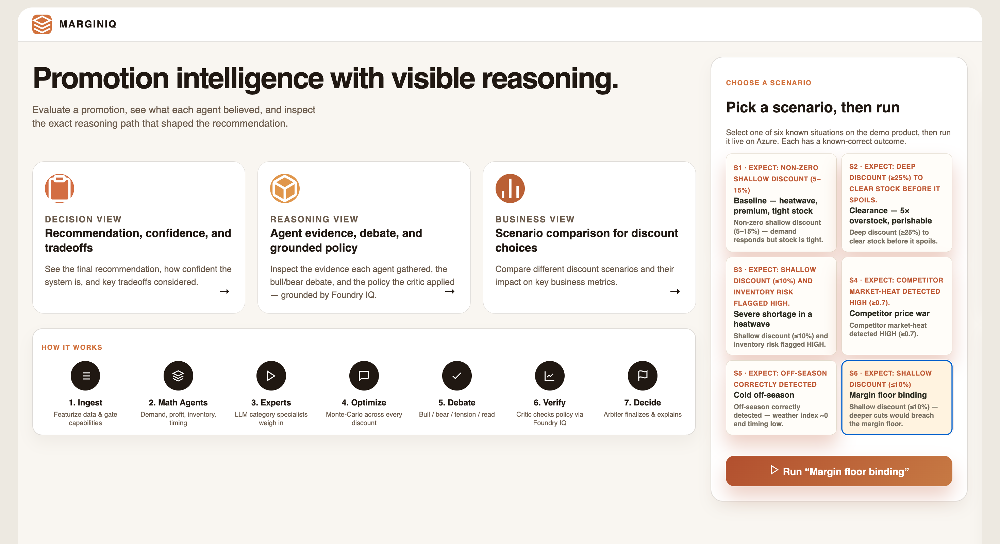
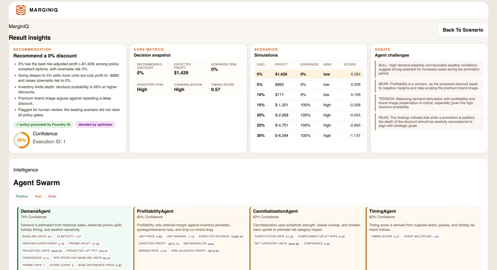

# MarginIQ

**A multi-agent reasoning system that recommends the profit-optimal promotion discount — and proves why.**

Built for the Microsoft Agents League → **Reasoning Agents** track.
Powered by **Azure AI Foundry** (gpt-4o) and grounded by **Foundry IQ**.

---

## The app

Pick one of six known scenarios and run it :



Every run shows the recommendation, calibrated confidence, the simulated discount curve,
the agent debate, and each agent's evidence — with the policy check grounded by Foundry IQ:



---

## The problem

A single retail promotion decision pulls in eight forces at once — price elasticity,
weather, inventory and spoilage, competitor pressure, margin floors, brand image,
cannibalization, and event timing. They conflict. A 30% discount that clears
perishable stock and avoids a write-off can be the right call in one situation and a
brand-destroying margin giveaway in another. No single rule balances them well, and a
wrong call costs tens of thousands in spoilage or lost margin.

MarginIQ treats the decision the way a category-management team would: a panel of
specialists each analyze one force, a moderated debate surfaces the trade-off, a
**policy critic grounded in real policy documents** vetoes anything non-compliant, and
an arbiter makes the final, auditable call.

---

## How it reasons

```
request → math agents → strategy experts → optimizer → debate → critic → arbiter → explanation
              (8 deterministic)   (LLM, rule-selected)  (Monte-Carlo)   (LLM)  (LLM+Foundry IQ) (LLM)
```

Three responsibilities are kept strictly separate:

- **The math decides the number** — controlled-regression elasticity, a time-bounded
  spoilage model, and a 300-sample Monte-Carlo simulation across every candidate discount.
- **The LLM applies judgment** — category strategy experts, a bull/bear/tension debate,
  and a final arbiter, all reading a rendered **ASCII profit/risk curve** rather than raw JSON.
- **Foundry IQ grounds the policy check** — the critic retrieves the relevant pricing-policy
  passages and **cites the document it applied**, so every accept/reject is traceable.

A shared blackboard (`AnalysisMemory`) carries findings between stages so context compounds.

See [ARCHITECTURE.md](ARCHITECTURE.md) for the full diagram and every agent's role.

---

## Microsoft IQ integration — Foundry IQ

The critic queries **Foundry IQ** for the policy
passages relevant to the current decision (built from category, discount depth, and
inventory/brand state) and cites the source in its verdict:

> *"Per [brand_guidelines.md → Reference-price protection], a 30% cut exceeds the 20%
> reference-price floor for premium items — but [clearance_policy.md → Spoilage pressure
> threshold] overrides it because clearance pressure is 41%."*

The grounding knowledge base ([knowledge_base/](knowledge_base/)) holds three synthetic
policy documents: `pricing_policy.md`, `brand_guidelines.md`, `clearance_policy.md`.
These are the source documents uploaded to the Foundry IQ knowledge base; the critic
retrieves cited passages from the hosted index at decision time.

---

## The signal: two ASCII curves, two recommendations

The LLM stages read the trade-off as a chart, not a JSON dump. The *shape* tells the story.

**Premium gelato, heatwave, tight stock** — profit peaks shallow, best at **5%**:

```
discount | expected profit (# = $)             | downside | risk
    5%   |############################        |     4%  | low  <= best
   20%   |######################              |    19%  | medium
   40%   |                                    |    67%  | high
```

**Clearance overstock, perishable** — spoilage makes shallow discounts a loss; best at **30%**:

```
discount | expected profit (# = $)             | downside | risk
    0%   |                            |    78%  | high
   15%   |##############              |    32%  | medium
   30%   |############################|    11%  | low  <= best
```

---

## Validation

MarginIQ is evaluated against six authored scenarios where the correct direction is
known in advance. Each is run live through the full Azure pipeline (gpt-4o + Foundry IQ).

| Scenario | Expectation | Recommended | Result |
|---|---|---|---|
| S1 baseline (heatwave, premium, tight stock) | shallow 5–15% | 5% | pass |
| S2 clearance overstock (5× stock, perishable) | deep ≥ 25% | 30% | pass |
| S3 severe shortage | shallow + high inventory risk | 0% | pass |
| S4 competitor price war | competitor market-heat high (≥0.7) | heat 0.85 | pass |
| S5 cold off-season | off-season detected | 10% | pass |
| S6 margin floor binding | shallow + margin breach flagged | 0% | pass |

**6/6 scenarios match expectation**, every one grounded by Foundry IQ. The estimator
also recovers a known true elasticity (1.85) within its confidence interval on a
synthetic ground-truth dataset. Full results: [results/scenario_results.json](results/scenario_results.json),
analysis in [RESULTS.md](RESULTS.md).

```bash
python tests/scenario_accuracy.py          # live 6-scenario accuracy run (writes results/)
pytest tests/test_elasticity_recovery.py   # estimator recovers known true elasticity
```

---

## Run locally

1. Install dependencies:

```bash
pip install -r requirements.txt
```

2. Configure credentials — copy `.env.example` to `.env` and fill in Azure AI Foundry
   and Foundry IQ (both required):

```bash
cp .env.example .env
# Azure AI Foundry (reasoning):
#   AZURE_AI_PROJECT_ENDPOINT=https://your-resource.services.ai.azure.com
#   AZURE_AI_API_KEY=...
#   AZURE_AI_MODEL_DEPLOYMENT=gpt-4o
# Foundry IQ (grounding, backed by Azure AI Search):
#   FOUNDRY_IQ_ENDPOINT=https://your-search-service.search.windows.net
#   FOUNDRY_IQ_API_KEY=...
```

3. Start the server:

```bash
uvicorn app.main:app --reload
```

4. Open the web app at `http://127.0.0.1:8000/` — it has **one-click buttons for all six
   demo scenarios**, so anyone can run and verify the system instantly. Interactive API
   docs are at `http://127.0.0.1:8000/docs`.

> MarginIQ runs exclusively on Azure — Azure AI Foundry for reasoning and Foundry IQ
> for grounding. Both are required; there is no alternate provider or local fallback.

---

## API

| Method | Endpoint | Purpose |
|---|---|---|
| `POST` | `/api/v1/analyze-promotion` | Analyze a promotion from a full request payload |
| `POST` | `/api/v1/analyze-seed` | Analyze the bundled synthetic demo product |
| `GET`  | `/api/v1/scenarios` | List the six demo scenarios and their expected outcomes |
| `POST` | `/api/v1/scenarios/{key}/analyze` | Run one demo scenario (`s1`…`s6`) end to end |
| `GET`  | `/api/v1/workflow-graph` | Inspect the agent workflow and capability registry |
| `GET`  | `/health` | Liveness check |

The quickest way to see MarginIQ work end to end:

```bash
curl -X POST http://127.0.0.1:8000/api/v1/scenarios/s2/analyze
```

---

## Tech stack

- **Azure AI Foundry** (gpt-4o) — all LLM reasoning, via strict JSON-schema structured output
- **Foundry IQ** — grounded, cited policy retrieval for the critic
- **FastAPI** + **Uvicorn** — API and runtime
- **LangGraph** — agent workflow orchestration
- **NumPy / SciPy / statsmodels** — controlled regression, demand, Monte-Carlo simulation
- **SQLite** — one persisted row per analysis run

---

## Responsible AI

- The critic enforces hard policy gates (margin floor, loss probability, service level)
  and the arbiter is guardrailed to choose only from policy-compliant scenarios.
- Every decision ships with `decision_factors` tied to the actual economics and a
  cited policy source — no black-box answers.
- **Confidence is calibrated** from the decision's own economics (score separation,
  downside risk, profitability, policy clearance), so it varies honestly with the
  situation rather than reporting a flat, reassuring number.
- All data is **synthetic**. No real, customer, or proprietary data is used.
- The accuracy harness acts as a regression contract guarding behavior across changes.
